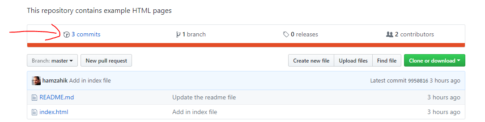
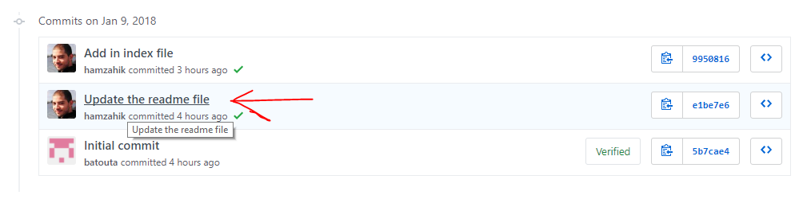
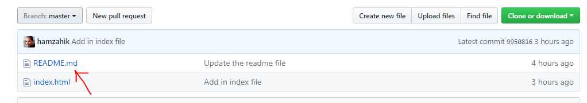
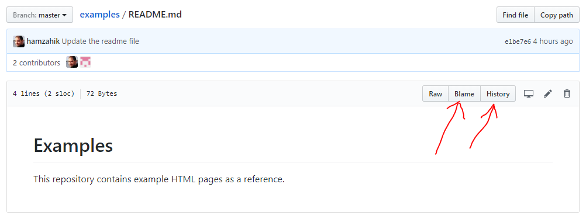

# HTML Examples

This repository contains example HTML pages.

# What is a repository ?

A database that will store all your files and the history of all the modifications applied to them. It will also store who did the modification and what did he modify exactly and when.

Only people that you authorize can change the content of your repository. But the the files and change history of your repository are accessible to everyone on the internet.

To make your repository **private** you need to pay for an account on Github and change your repository settings. Other **Git** hosting websites offer this feature for free (having private repositories).

# What is Git ?

A code source repository is as we said earlier a database that stores your files and there change history. Git is a type of code source repositories (one of the most popular ones). Github is a service that offers the hosting of Git repositories for free but you can upgrade later to a paid account if you need more features.

# What are the Git operations I should be familiar with ?

For now, all you need to know about Git is the following operations :

- clone : copy a repository from github, or another service/server to your machine (The copy also contains the history of all the changes)
- push : send the committed changes to the remote server/service (from where you clonned the repository for instance). Only committed changes are sent.
- add changes/files to the stage : You need to explicitly tell Git what modifications do you want him to save in his database. This is called adding a file/change to the stage. When a file/change is added to the stage Git doesn't save the changes yet to his database, but he will wait for you to call the "commit" operation.
- commit changes : When you have grouped the modifications that belong to the same "theme" you should add a comment about the changes you have done and click on the commit button. Theses comments will help you as well as anyone who will read the code in the future, understand why you did those changes.

# CSS resources

- Flex display : https://css-tricks.com/snippets/css/a-guide-to-flexbox/
- CSS selectors : https://www.w3schools.com/cssref/css_selectors.asp

# How to see the history of changes of the repository ?

1. Display the commits list

2. Click on a commit's title to see it's content

# How to see the history of changes of a single file ?

1. Click on a file on the files list

2. You can use the buttons "history" and "blame" to see the change history and who did what
